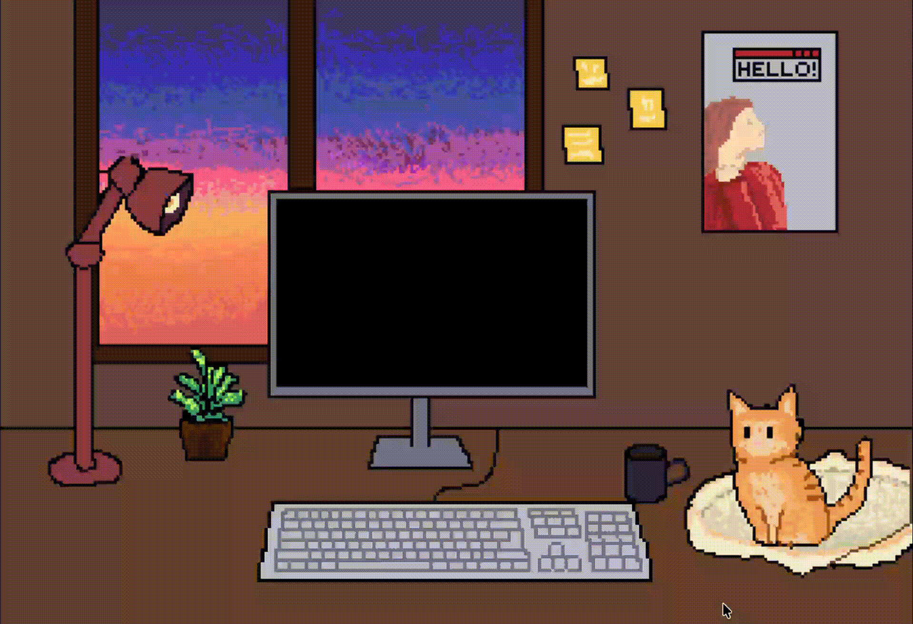

# 🐈 Pixel Room

> A small interactive pixel-art room made with React and TypeScript.



Pixel Room is a cozy interactive scene where the room is not just a static image.
Different objects can react to user interaction, change their state and play small pixel-art animations.

The project is focused on atmosphere, animation and simple interactions rather than traditional gameplay.

## ✨ Features

- 🖼️ Pixel-art room environment
- 🖱️ Interactive objects
- ⌨️ Clickable pixel-art keyboard
- 🎞️ Frame-by-frame animations
- 💡 Objects with different states
- 🌙 Potential day / evening / night states
- 🌧️ Weather animations
- 🐈 Interactive pet
- 💾 Local state persistence

## 🎮 Interaction

The room contains interactive objects that can respond to user actions.

For example, clicking the keyboard starts a short frame-by-frame animation:

```text
┌─────────────┐
│   Frame 1   │
└──────┬──────┘
       ↓
┌─────────────┐
│   Frame 2   │
└──────┬──────┘
       ↓
┌─────────────┐
│   Frame 3   │
└──────┬──────┘
       ↓
┌─────────────┐
│   Frame 4   │
└─────────────┘
```

The goal is to make the scene feel alive through small details and reactions.

🛠️ Tech Stack
React
TypeScript
Vite
CSS
HTML
Local pixel-art assets

### 📁 Project Structure
```
src/
├── assets/
│   ├── room/
│   ├── keyboard/
│   ├── pet/
│   └── objects/
│
├── components/
│   ├── Room/
│   ├── Keyboard/
│   └── Pet/
│
├── App.tsx
├── App.css
└── main.tsx
```

### 🚀 Getting Started

Clone the repository:

```
git clone <repository-url>
cd pixel-room
```
Install dependencies:
```
npm install
```
Start the development server:
```
npm run dev
```
Open the local address shown in the terminal.

### 🧩 Architecture

The room is built as a collection of independent visual layers and interactive elements.
```
Room
│
├── Background
│
├── Environment
│   ├── Window
│   ├── Furniture
│   ├── Lamp
│   └── Plants
│
├── Interactive objects
│   ├── Keyboard
│   ├── Lamp
│   └── Other objects
│
└── Pet
├── Idle
├── Walking
├── Sleeping
└── Interactions
```
This approach makes it possible to add new objects and animations without rebuilding the whole scene.

### 🌱 Future Ideas
```
Day / evening / night cycle
Rain and snow
Passing cars outside the window
Animated lights in neighboring buildings
Interactive pet
More keyboard animations
Ambient sounds
Object-specific animations
LocalStorage for persistent state
More interactive objects
```